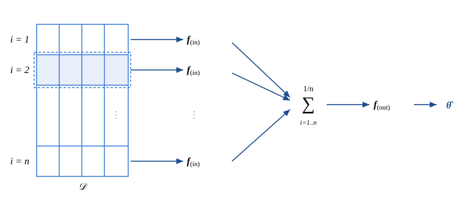

.. _fnne:

Full-information NNE
====================

|

This page describes the **full-information neural net estimator (full-information NNE)**, based on
Wei and Jiang (2026), "Estimating and Assessing Identification of Structural Models via Deep Learning"
(see `paper`_ below).

Unlike the :ref:`moment-based NNE <nne>`, which feeds the neural net a set of researcher-specified
moments :math:`\boldsymbol{m}`, full-information NNE uses the **whole dataset** as input. It can
automatically exploit variation in the data, and is thus useful not only for **estimating** a
structural model but also for **assessing the identification** of the model.

Below we give a brief overview of full-information NNE, and then provide the code we use to estimate:
(i) a :ref:`mixed logit model <fnne_mixed_logit>`, and
(ii) a :ref:`search model with unobserved consumer heterogeneity <fnne_consumer_search>`.

|

Overview
--------

Suppose that a structural econometric model specifies some outcome of interest :math:`\boldsymbol{y}_i`
as a function of some observed attributes :math:`\boldsymbol{x}_i`, some unobserved shocks
:math:`\boldsymbol{\varepsilon}_i`, and a parameter vector :math:`\boldsymbol{\theta}`. Examples are
random utility maximization, consumer search, entry game, etc. A dataset is
:math:`\mathcal{D} = \{\boldsymbol{y}_i, \boldsymbol{x}_i\}_{i=1}^{n}`, and we assume observations are
i.i.d. across :math:`i` (e.g., cross-sectional or panel data). We train a neural net as follows.

#. **Simulate data.** For each :math:`\ell`, draw :math:`\boldsymbol{\theta}^{(\ell)}` from a prior. Given :math:`\boldsymbol{\theta}^{(\ell)}`, use the structural model to simulate :math:`\boldsymbol{y}_i^{(\ell)}` given :math:`\boldsymbol{x}_i` for each :math:`i`. Let :math:`\mathcal{D}^{(\ell)} \equiv \{\boldsymbol{y}_i^{(\ell)}, \boldsymbol{x}_i\}_{i=1}^{n}`.

#. **Repeat.** Repeat the first step :math:`L` times to obtain :math:`\{\boldsymbol{\theta}^{(\ell)}, \mathcal{D}^{(\ell)}\}_{\ell=1}^{L}`.

#. **Train a neural net** with the architecture below to predict :math:`\boldsymbol{\theta}^{(\ell)}` from :math:`\mathcal{D}^{(\ell)}`.

The neural net uses a **two-part architecture** that exploits the i.i.d. data structure. The first
part transforms each observation into a vector of features. The second part then maps the *averaged*
features across :math:`i` into an estimate of :math:`\boldsymbol{\theta}`. This architecture is
essential to make the training feasible. In implementation, the architecture can be coded as a
convolutional neural net (CNN).

   The two-part architecture. Each observation :math:`i` in the dataset :math:`\mathcal{D}` is mapped
   to a feature vector by :math:`\boldsymbol{f}_{(\mathrm{in})}`; the features are averaged across
   :math:`i`; and the average is mapped by :math:`\boldsymbol{f}_{(\mathrm{out})}` to an estimate
   :math:`\hat{\boldsymbol{\theta}}`.

Importantly, this architecture is **not restrictive**: the trained neural net can still learn the
full-information posterior :math:`\mathbb{E}(\boldsymbol{\theta} \mid \mathcal{D})`. In fact, the paper
shows that the neural net converges to the full-information posterior as :math:`L` grows. The paper
also shows how a second neural net can be trained to learn
:math:`\mathrm{Var}(\boldsymbol{\theta} \mid \mathcal{D})`. Finally, the paper shows how to make use of
full-information NNE to **assess the identification** of a structural model.

|

Applications
------------

We provide Matlab code for two applications.

.. list-table::
   :widths: 28 72
   :header-rows: 0
   :class: table-header-centered

   * - :ref:`Mixed logit model <fnne_mixed_logit>`
     - Likelihood is easy to simulate here, so full-information NNE does not really have an advantage over SMLE. But it offers a good setting to demonstrate and understand the method.
   * - :ref:`Consumer search model <fnne_consumer_search>`
     - A sequential search model with unobserved consumer heterogeneity.

|

|

Paper
-----

Wei and Jiang (2026). "Estimating and Assessing Identification of Structural Models via Deep Learning."
`SSRN <https://papers.ssrn.com/sol3/papers.cfm?abstract_id=6774178>`__

|

.. toctree::
   :hidden:

   Overview <self>
   Mixed Logit Model <mixed_logit>
   Consumer Search <consumer_search>
