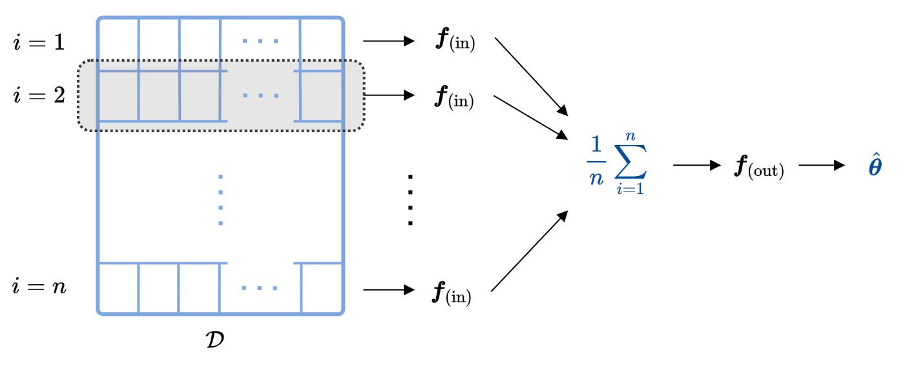

.. _fnne:

Full-information NNE
====================

|

We provide an overview and code for the full-information Neural Net Estimator (full-info NNE), based on the paper :note-text:`"Estimating and Assessing Identification of Structural Models via Deep Learning."` 

1. Overview
-----------

NNE is an approach to estimate structural econometric models (e.g., discrete choice, consumer search, games). Let the structural model's parameter vector be :math:`\boldsymbol{\theta}`. The basic idea is to train a neural net that can recognize the value of :math:`\boldsymbol{\theta}` from data. The :ref:`original NNE <nne>` uses researcher-specified moments as input to the neural net. In contrast, full-info NNE frees researchers from specifying moments and *uses the entire dataset as input*.

The key challenge is that with a large input like an entire dataset, we typically must put a structure on the neural net architecture to make training feasible. Meanwhile, we want this architecture to be non-restrictive such that the neural net can still use all the information in data. It turns out that, when data have an i.i.d. structure (e.g., cross-sectional or panel), there is an architecture that allows us to achieve these two goals.

The full-information NNE is trained as follows.

#. Draw a value of :math:`\boldsymbol{\theta}` from a prior. Given this value and the real-data product/consumer attributes, use the structural model to simulate a dataset.

#. Repeat the above step :math:`L` times to obtain :math:`L` pairs of values of :math:`\boldsymbol{\theta}` and datasets. These pairs are our training examples.

#. Use the :math:`L` examples to train a neural net with the "two-part architecture" to predict the value of :math:`\boldsymbol{\theta}` from a dataset.

The "two-part architecture" first transforms each observation into a vector of features, and then uses the average features across observations to predict the value of :math:`\boldsymbol{\theta}`. Implementing this architecture is easy because it can be conveniently coded as a convolutional neural net (CNN). In the paper, it is shown that this architecture is not restrictive: the neural net converges to the *full-information* posterior mean of :math:`\boldsymbol{\theta}` as we increase :math:`L`. The paper also shows how to train a second neural net to learn the full-information posterior variance.

2. Applications
----------------

We provide Matlab code for two examples: 

* **A mixed logit model**. Because the likelihood for mixed logit is relatively easy to simulate, full-info NNE shows no advantages in accuracy or computation here. But this setting serves as a good example to illustrate how full-info NNE works in practice.

* **A search model with unobserved consumer heterogeneity**. This example shows the advantages of full-info NNE in accuracy and computation.

You can find the code at this `GitHub directory <https://github.com/nnehome/fnne-matlab-code>`__, and code documentation at the :ref:`mixed logit model <fnne_mixed_logit>` page and the :ref:`search model <fnne_search>` page.

|

.. toctree::
   :hidden:

   Overview <self>
   Mixed Logit Model <fnne_mixed_logit>
   Search Model <fnne_search>
