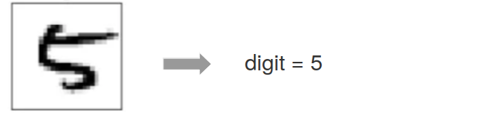

:html_theme.sidebar_secondary.remove:

:parenttoc: True

.. _home:

Welcome to NNE
===============

|

This website provides a guide and code of the neural net estimator (NNE) (`Wei and Jiang (2023) <https://papers.ssrn.com/sol3/papers.cfm?abstract_id=3496098#>`_).

NNE is a method to estimate (structural) econometric models. It exploits machine learning techniques for estimating a given econometric model. It can achieve good estimation accuracy at light computational costs, and thus provides an alternative to simulated maximum likelihood or simulated method of moments. 

Below, we describe the main idea of NNE, applicability, and usual procedure to apply it.

On the :ref:`code` page, we provide the code for the application of NNE to consumer sequential search model.

|

Overview
---------------

A (structural) econometric model specifies some outcome of interest :math:`\boldsymbol{y}\equiv\{y_i\}_{i=1}^{n}` (e.g., consumer choice, total sales) as a function of some observed attributes :math:`\boldsymbol{x}\equiv\{\boldsymbol{x}_i\}_{i=1}^{n}` (e.g., consumer and product characteristics) and some unobserved attributes :math:`\boldsymbol{\epsilon}`. The function is often an economic model such as random utility maximization, sequential search, game, etc.

So we can denote a structural econometric model as :math:`\boldsymbol{y} = \boldsymbol{g}(\boldsymbol{x}, \boldsymbol{\epsilon},  \boldsymbol{\theta})`, where :math:`\boldsymbol{\theta}` is the parameter of the model. The goal of structural estimation is to recover the parameter :math:`\boldsymbol{\theta}` from data.

The basic idea of NNE is to train neural nets to recognize :math:`\boldsymbol{\theta}` from data :math:`\{\boldsymbol{x, y}\}`. 

To train such a neural net, we draw many different values of the parameter. Given each value of parameter, use the structural model to generate a copy of data. Then these many values of parameters and their corresponding copies of data become the training examples for the neural net. See `Procedure`_ below for details.

An Analog
---------------

One way to grasp the concept of NNE is making an analog to digit recognition. Machine learning models have been trained to recognize the digits underlying handwritten images (below is an example). 

Conceptually, this can be thought of as a parameter estimation problem, where the *data* is the image and the *parameter* is the underlying digit.  NNE also tackles parameter estimation, but where the *data* is an economic dataset and the *parameter* is that of an econometric model.

  

Procedure
---------------

Context: we want to estimate a (structural) econometric model with a given dataset. The dataset is denoted as :math:`\{\boldsymbol{x, y}\}`, with :math:`\boldsymbol{y}\equiv\{y_i\}_{i=1}^{n}` and :math:`\boldsymbol{x}\equiv\{\boldsymbol{x}_i\}_{i=1}^{n}`. What we need: the ability to simulate the outcome variable :math:`\boldsymbol{y}` using the econometric model.

We will use :math:`\ell` to index the training examples that we use to train the neural net in NNE.

**Cookbook procedure to apply NNE**

#. **Draw parameter values.** For each :math:`\ell`, draw parameter values :math:`\boldsymbol{\theta}^{(\ell)}` from a parameter space :math:`\Theta`. (We specify :math:`\Theta` so that it likely contains the true :math:`\boldsymbol{\theta}`. If we have a prior, we may also draw :math:`\boldsymbol{\theta}^{(\ell)}` from the prior distribution.)

#. **Simulate data.** For each :math:`\ell`, use the structural econometric model to simulate a set of outcomes :math:`\boldsymbol{y}^{(\ell)}`, under the parameter :math:`\boldsymbol{\theta}^{(\ell)}` and the observed attributes :math:`\boldsymbol{x}`.

#. **Summarize data.** For each :math:`\ell`, summarize the data :math:`\{\boldsymbol{y}^{(\ell)}, \boldsymbol{x}\}` into a set of data moments :math:`\boldsymbol{m}^{(\ell)}`. (We specify :math:`\boldsymbol{m}` so that it contains information for recovering :math:`\boldsymbol{\theta}`. Common examples include the mean of :math:`\boldsymbol{y}` and the covariances between :math:`\boldsymbol{y}` and :math:`\boldsymbol{x}`.)

#. **Put together a training set.** Repeat step 1-3 for :math:`\ell=1,...,L` to construct the training set :math:`\{\boldsymbol{m}^{(\ell)},\boldsymbol{\theta}^{(\ell)}\}_{\ell=1}^{L}`. We can also repeat these steps more times for :math:`\ell=L+1,...,L^{*}` to create a validation set.

#. **Train a neural net.** Use the training and validation sets in step 4 to train a neural net. (We can use mean-square-error loss. Other losses can train the neural net to give measures of statistical accuracy in addition to point estimates. See `Wei and Jiang (2023) <https://papers.ssrn.com/sol3/papers.cfm?abstract_id=3496098#>`_ for details.)

#. **Get the estimate.** Plug the real data moments into the neural net to obtain an estimate of :math:`\boldsymbol{\theta}`.

|

Applicability
---------------

Notation: :math:`{\theta}^{(\ell)}` drawn from a space; :math:`\Theta`; :math:`{y}^{(\ell)}` simulated outcome; :math:`{m}^{(\ell)}` simulated moments; :math:`\widehat{\theta}` neural net prediction.

Besides computational benefits, NNE is also robust to redundant or irrelevant moments.
This is in contrast to SMM, where even with sufficiently many simulations, redundant moments are known to increase 
finite-sample biases.
Because of these benefits, NNE is especially suitable for cases where many simulations are needed to evaluate 
likelihood/moment functions, as well as cases where there lacks clear guidance on what moments to use for estimation. 
In these applications, NNE offers a computationally light alternative to obtain accurate and robust estimates. 
Outside these applications, NNE may still be applied but may not show clear gains. We summarize main properties of 
NNE and the suitable (and less suitable) applications in the table below. 

.. _main-properties-table:

The main properties and suitable applications of the estimation method are summarized below:

.. list-table:: 
   :widths: 10 90
   :header-rows: 1
   :class: table-header-centered

   * - 
     - Main Properties
   * - 1
     - It requires no integration over unobservables in the structural econometric model; only requires the ability to simulate data using the econometric model.
   * - 2
     - It does not require the optimization over an (potentially non-smooth) objective function as in extremum estimators (e.g., SMLE, SMM, indirect inference).
   * - 3
     - It is more robust to redundant moments when compared to SMM/GMM.
   * - 4
     - It computes a measure of statistical accuracy (i.e., posterior variance) as a byproduct.

.. list-table:: 
   :widths: 50 50
   :header-rows: 1
   :class: table-header-centered

   * - Suitable Applications
     - Less Suitable Applications
   * - Many simulations are needed to evaluate likelihood/moments. The SMLE/SMM objective is difficult to optimize. There lacks clear guidance on moment choice. Formulas of standard errors are not yet established.
     - Close-form expressions are available for likelihood/moments. The main estimation burden comes from other than the simulations to evaluate likelihood/moments.
   * - **Examples**: discrete choices with rich unobserved heterogeneity, sequential search, choices on networks.
     - **Examples**: dynamic choice or games where the main burden is solving policy functions.

|

Overview of NNE
---------------
We write down a structural model: ``y = g(x, ϵ; θ)``, where :math:`{x}` denote the observed attributes,
:math:`\epsilon` is the unobservable, and :math:`\theta` is the parameter. The goal of structural estimation is 
to obtain the parameter :math:`θ` with observable :math:`{x}` and outcome :math:`y`: ``{y,x} → θ``.

The key idea of NNE is to use neural nets to directly learn the mapping from data to parameters. 
The graph below provides an overview of NNE.

.. math::
   :label: neural-net-training

   \begin{align*}
   \text{train a neural net } f(\cdot) \quad
   \begin{cases}
   \boldsymbol{\theta}^{(1)} \xrightarrow{\boldsymbol{g}(\boldsymbol{x}_{i},\boldsymbol{\varepsilon}_{i}^{(1)};\boldsymbol{\theta}^{(1)})} & \{\boldsymbol{y}_{i}^{(1)},\boldsymbol{x}_{i}\}_{i=1}^{n} \xrightarrow{\text{moments}} \boldsymbol{m}^{(1)} \xrightarrow{\text{neural net}} \widehat{\boldsymbol{\theta}}^{(1)} \\
   \boldsymbol{\theta}^{(2)} \xrightarrow{\hspace{6em}} & \{\boldsymbol{y}_{i}^{(2)},\boldsymbol{x}_{i}\}_{i=1}^{n} \xrightarrow{\hspace{4em}} \boldsymbol{m}^{(2)} \xrightarrow{\hspace{4.3em}} \widehat{\boldsymbol{\theta}}^{(2)} \\
   \vdots & \vdots \\
   \boldsymbol{\theta}^{(L)} \xrightarrow{\hspace{6em}} & \{\boldsymbol{y}_{i}^{(L)},\boldsymbol{x}_{i}\}_{i=1}^{n} \xrightarrow{\hspace{4em}} \boldsymbol{m}^{(L)} \xrightarrow{\hspace{4em}} \widehat{\boldsymbol{\theta}}^{(L)}
   \end{cases}
   \end{align*}

.. math::
   :label: neural-net-application

   \begin{align*}
   \text{apply } f(\cdot) \text{on real data} \quad \quad
   \begin{cases}
   \{\underbrace{\boldsymbol{y}_{i},\boldsymbol{x}_{i}}_{\text{real data}}\}_{i=1}^{n} \xrightarrow{\text{moments}} \boldsymbol{m} \xrightarrow{\text{neural net}} \underbrace{\widehat{\boldsymbol{\theta}}}_{\text{estimate}}
   \end{cases}
   \end{align*}

Notation: :math:`{\theta}^{(\ell)}` drawn from a space; :math:`\Theta`; :math:`{y}^{(\ell)}` simulated outcome; :math:`{m}^{(\ell)}` simulated moments; :math:`\widehat{\theta}` neural net prediction.

**Four steps to apply NNE with ()**

1. We draw parameter values :math:`\theta^{(l)}` uniformly from a parameter space :math:`\Theta`. Using the structural model, we can generate the outcome :math:`y^{(l)}` under :math:`\theta^{(l)}`. After repeating this procedure a number of times, we get the corresponding datasets that are generated under a range of parameter values. These datasets form the basis of the training examples that we can use to learn the mapping from data to the "correct" parameter values.

2. To make training easier, we can summarize the data :math:`\{y^{(l)}, x\}`  into data moments :math:`m^{(l)}`.

3. The neural net takes the data moments as input and predicts the parameter value underlying that dataset.

4. Once the neural net is trained, we plug in the real data moments to obtain NNE estimates :math:`\hat{\theta}`.

The neural net can output "standard errors" in addition to point estimates. We establish that this neural net estimator (NNE)
converges to limited-information Bayesian posterior when the number of training datasets L is sufficiently large. 

|

Applying NNE
---------------

While the method is broadly applicable to many types of structural models, we use the consumer sequential search model to illustrate how to use NNE. 
Below, we describe the two key functions ``nne_gen.m`` and ``nne_train.m`` to implement NNE. The other accompanying functions are described in the :ref:`code` page.

All Matlab codes can be found on the `GitHub <https://github.com/nnehome/nne-matlab>`_ page. 
These codes can be used to replicate the Monte Carlo results from `Wei and Jiang (2023) <https://papers.ssrn.com/sol3/papers.cfm?abstract_id=3496098#>`_.

Generate training datasets ``nne_gen.m``
''''''''''''''''''''''''''''''''''''''''

``nne_gen.m``: This function implements steps (1) and (2) from the overview of NNE.

.. code-block:: matlab
    :class: scrollable-code-block

    %% set up

    clear; 
    seed = 1; 
    type = 4; % denotes the type of moments in the Moments() function

    tic;

    rng(seed)

    L = 10000; % number of simulations

    set_up % generate a search dataset, save in data.mat

    load('data.mat')

    % table with (normalized) search cost and reservation utility
    curve = importdata('tableData.csv'); 

    %% simulate

    input = cell(L,1);
    label = cell(L,1);

    for l = 1:L

        theta = unifrnd(lb, ub);

        [yd, yt] = gen_seq_search(pos, z, consumer_id, theta, ...
            randn(length(consumer_id),1), randn(length(unique(consumer_id)),1), curve);

        % keep non-outlier informative draws 
        [buy_rate, search_rate] = Statistics(yd, yt, pos, consumer_id, false);

        if buy_rate > 0 && buy_rate < 1 && search_rate > 0 && search_rate < 1

            input{l} = Moments(pos, z, consumer_id, yd, yt, type);
            label{l} = theta;

        end

    end

    % remove empty cells (outliers)
    input = input(~cellfun('isempty',input));
    label = label(~cellfun('isempty',label));

    input = cell2mat(input);
    label = cell2mat(label);

    %% save 

    n = size(input,1);

    input_train = input(1:floor(n*0.9),:);
    label_train = label(1:floor(n*0.9),:);

    input_test = input(floor(n*0.9)+1:n,:);
    label_test = label(floor(n*0.9)+1:n,:);

    %% generate simulated real data (for Monte Carlo)

    [yd, yt] = gen_seq_search(pos, z, consumer_id, theta_true, ...
        randn(length(consumer_id),1), randn(length(unique(consumer_id)),1), curve);

    input_sim_real = Moments(pos, z, consumer_id, yd, yt, type);
    label_sim_real = theta_true;

    %% save training set and seed
    toc;

    time_gen = toc/60;

    save('training_set.mat', 'input_train', 'label_train', 'input_test', 'label_test', ...
                            'input_sim_real', 'label_sim_real', 'label_name', ß'time_gen')

    state = rng;
    save('RNGstate.mat','state')

Several key steps include:

- Draw :math:`\theta^{(l)}` ``theta = unifrnd(lb, ub)``. Ideally, the bounds to draw :math:`\theta^{(l)}` from should cover the true parameter value. When :math:`\Theta` does not cover the true value, NNE’s estimate can fall outside :math:`\Theta` and in the direction towards the true value. One should check whether NNE’s estimate is inside :math:`\Theta`. If not, then :math:`\Theta` likely does not contain the truth and needs to be adjusted.
- Simulate outcome :math:`y^{(l)}` with function ``gen_seq_search()``, which takes parameter :math:`\theta^{(l)}` and error draw :math:`\epsilon^{(l)}`. This function is specific to sequential search and can be changed to other structural models.
- Summarize the data :math:`\{y^{(l)},x\}` into data moments :math:`m^{(l)}` with function ``Moments()``. It can be adapted to generate moments in other applications.
- We use 90% as training data and the rest 10% as testing data. The inputs are the moments while the labels are the corresponding correct parameters.
- For the Monte Carlo estimation, we also generate a simulated “real” data under assumed parameter ``theta_true``. The simulated “real” data moments are calculated using function ``Moments()``.

Train a neural network ``nne_train.m``
''''''''''''''''''''''''''''''''''''''

``nne_train.m``: This function implements steps (3) and (4) from the overview of NNE.

.. code-block:: matlab
    :class: scrollable-code-block

    %% settings

    clear; 
    L = 10000; 
    num_nodes=64;
    tic;

    load('RNGstate.mat')
    rng(state)

    learn_standard_error = true;
    batch_size = 500;

    %% read data

    load('training_set.mat')

    L_train = size(input_train, 1);
    L_test  = size(input_test, 1);

    dim_in  = size(input_train, 2);
    K = size(label_train, 2);

    if learn_standard_error
        dim_out = 2*K;        

        label_train = [label_train, zeros(L_train, K)];
        label_test  = [label_test,  zeros(L_test, K)]; 

    else
        dim_out = K;
    end

    %% training

    opts = trainingOptions( 'adam', ...
                            'ExecutionEnvironment','cpu',...
                            'LearnRateSchedule','piecewise', ...
                            'LearnRateDropFactor', 0.1, ...
                            'LearnRateDropPeriod', 200, ...
                            'InitialLearnRate' , 0.01, ...
                            'GradientThreshold', 1,...
                            'MaxEpochs', 300, ...
                            'Shuffle','every-epoch',...
                            'MiniBatchSize', batch_size,...
                            'L2Regularization', 0, ...
                            'Plots','none', ...
                            'Verbose', true, ...
                            'ValidationData', {input_test, label_test}, ...
                            'ValidationFrequency', 100);
    

    layers = [
                featureInputLayer(dim_in, 'Normalization', 'rescale-symmetric')
                fullyConnectedLayer(num_nodes)
                reluLayer
                fullyConnectedLayer(dim_out)
                normalRegressionLayer('simple', ~ learn_standard_error)
             ];

    [net, info] = trainNetwork(input_train, label_train, layers, opts);

    %% summary

    err = PredSummary(input_test, label_test, label_name, net, 'figure', 0, 'table', 1);  

    %% obtain NNE estimate

    temp = predict(net, input_sim_real, 'acceleration', 'none');
    theta = temp(1:K);

    if learn_standard_error
        se = PositiveTransform(temp(K+1:2*K));
    end

    toc;
    time_train = toc/60;

    out = [theta, se, L, info.FinalValidationLoss, time_gen, time_train];

    csvwrite(sprintf('theta_L%d_nodes%d.csv', L, num_nodes), out);

Several key steps include:

- We can ask NNE to output standard errors by setting ``learn_standard_error = true;``. It will double the dimensionality of the NNE output by including both the point estimates and the standard errors.
  
- Train the neural net with function: ``[net, info] = trainNetwork(input_train, label_train, layers, opts);``

  - ``layers`` defines the network structure (e.g., number of layers and nodes)
  - ``opts`` defines the training specification (e.g., number of epochs and batch size)
  - The loss function is defined in ``normalRegressionLayer``, which depends on whether neural net needs to learn standard errors.

- For the Monte Carlo estimation, obtain estimates for the simulated “real” data with function: ``predict(net, input_sim_real, 'acceleration', 'none');`` where ``net`` denotes the trained neural network.
